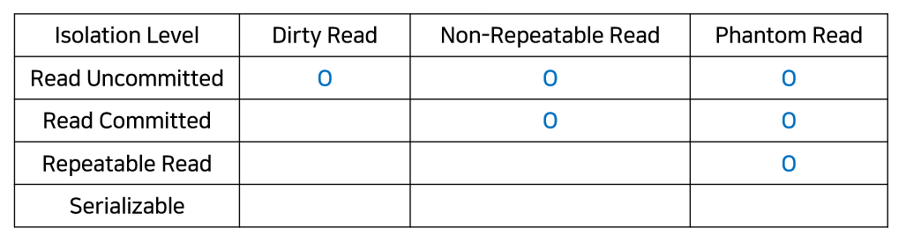

## 트랜잭션 격리성

> 격리성 수준은 읽기 작업과 수정 작업이 충돌할 때 데이터 일관성을 어떻게 유지할지에 대한 수준별 설정이다.

### 1. Read Uncommitted (읽기 비고립)
- 다른 트랜잭션에 의해 변경되었지만 아직 커밋되지 않은 데이터를 읽을 수 있다.
- A 트랜잭션이 특정 테이블의 데이터를 수정중에도 B 트랜잭션은 해당 테이블에 접근하여 데이터를 조회할 수 있으며, 심지어 아직 커밋되지 않은 A 트랜잭션이 변경한 데이터 내용으로 보여진다.

### 2. Read Committed (읽기 고립)
- 커밋된 데이터만 읽을 수 있으며, 두 번의 읽기 작업 중 변경된 내용은 반영된다. (동일성 보장 x)
- A 트랜잭션이 특정 테이블의 데이터를 수정중에도 B 트랜잭션은 해당 테이블에 접근하여 데이터를 조회할 수 있으나, A 트랜잭션이 아직 커밋하지 않은 데이터 변경 내용은 확인할 수 없다. (데이터 변경 이전의 데이터만 조회가능)
- B 트랜잭션이 두 번의 읽기 작업을 수행할 때, 그 사이 A 트랜잭션이 변경한 내용이 커밋되면 B 트랜잭션은 두 번의 조회결과가 달라져버린다.

### 3. Repeatable Read (반복가능한 읽기) - MySQL default setting
- 커밋된 데이터만 읽을 수 있으며, 트랜잭션 시작 시점에 읽은 데이터는 트랜잭션이 끝날 때까지 동일성이 보장된다.
- A 트랜잭션이 두 번의 읽기 작업을 수행중이고, 그 사이 B 트랜잭션이 변경한 내용이 커밋되어도 A 트랜잭션에는 해당 내용이 반영되지 않아 일관성을 유지할 수 있다.

### 4. Serializable (직렬화) 
- 격리성이 가장 높고, 동시성이 가장 낮다.
- 가장 엄격한 고립 수준으로, 트랜잭션을 순차적으로 실행하는 것처럼 보장한다.
- 모든 트랜잭션이 읽기만 수행한다면 동시에 접근할 수 있지만, 업데이트와 같은 변경 작업이 포함된 경우에는 다른 트랜잭션의 접근이 제한된다 (읽기 작업이라도). 이는 데이터의 일관성을 최대한 보장하지만 동시성 처리 능력은 제한된다.

---
## 트랜잭션 고립성에서 발생할 수 있는 문제

### 더티 리드 (Dirty Read)
- 한 트랜잭션이 아직 커밋되지 않은 데이터를 다른 트랜잭션이 읽는 경우 발생한다.
- 예를 들어, 트랜잭션 A가 어떤 데이터를 변경하고 아직 커밋하지 않았는데, 트랜잭션 B가 그 변경된 데이터를 읽는 경우다.  **만약 트랜잭션 A가 이후 롤백되면**, 트랜잭션 B는 잘못된 데이터를 기반으로 작업을 수행한 것이 되어 데이터의 정확성이 손상될 수 있다.

### 논리피터블 리드 (Non-Repeatable Read)
- 한 트랜잭션이 동일한 데이터를 두 번 이상 읽을 때, 그 사이에 다른 트랜잭션이 해당 데이터를 변경하고 커밋하는 경우 발생한다. 
- 예를 들어, 트랜잭션 A가 어떤 계좌의 잔액을 조회한 후, 다시 조회하기 전에 트랜잭션 B가 그 계좌의 잔액을 변경하고 커밋했다면, 트랜잭션 A는 두 번의 조회에서 서로 다른 잔액 정보를 얻게 된다.

### 팬텀 리드 (Phantom Read)
- 한 트랜잭션이 특정 조건으로 데이터를 조회할 때, 그 사이에 다른 트랜잭션이 새로운 데이터를 삽입하거나 기존 데이터를 삭제하는 경우 발생한다.
- 예를 들어, 트랜잭션 A가 특정 조건을 만족하는 모든 계좌를 조회하는 중, 트랜잭션 B가 새로운 계좌를 추가하고 커밋했다면, 트랜잭션 A가 다시 같은 조건으로 조회했을 때 새로운 계좌가 '팬텀(유령)'처럼 나타난다.

> 이러한 문제들은 트랜잭션 고립 수준을 조정하여 해결할 수 있다. 고립 수준이 낮을수록 동시성은 증가하지만, 위와 같은 문제들의 발생 가능성도 높아진다. 반면, 고립 수준을 높이면 데이터의 일관성은 보장되지만, 동시성 처리 능력이 감소한다. 따라서, 애플리케이션의 요구 사항과 데이터베이스의 특성을 고려하여 적절한 트랜잭션 고립 수준을 선택해야 한다.

