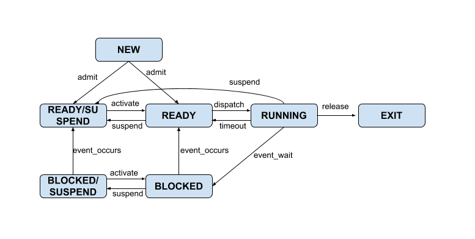

# PCB

> PCB(Process Control Block)는 '프로세스 제어 블록'으로, 운영 체제가 프로세스를 관리하기 위해 사용하는 중요한 데이터 구조이다.
>   PCB는 프로세스에 대한 모든 중요한 정보를 저장하며, 프로세스의 상태, 프로그램 카운터, 레지스터 값, 메모리 관리 정보, 프로세스 우선순위, 입출력 상태 정보 등 다양한 정보를 포함한다.

## PCB의 주요 구성 요소
### 1. **프로세스 식별자(Process ID)**
- 각 프로세스를 구별하는 고유한 식별 번호이다.

### 2. **프로그램 카운터(Program Counter)**
- 프로세스가 다음에 실행할 명령어의 주소를 가리킨다.

### 3. **CPU 레지스터와 상태 정보**
- 현재 프로세스의 레지스터 값과 상태 정보를 저장한다.

 
### 4. **CPU 스케줄링 정보**
- 프로세스 우선순위, 스케줄링 큐 정보 등 스케줄링과 관련된 정보를 포함한다.

### 5. **메모리 관리 정보**
- 프로세스의 주소 공간, 페이지 테이블 등 메모리 관련 정보를 저장한다.

### 6. **입출력 상태 정보**
- 프로세스에 할당된 입출력 장치와 파일 목록 등의 정보를 포함한다.

## PCB의 역할

### 1. **프로세스 관리** 
- 운영 체제는 PCB를 사용하여 각 프로세스의 상태를 관리하고, 프로세스 간 전환(context switching) 시 필요한 정보를 저장하거나 복원한다.
 

### 2. **시스템 자원 관리**
- PCB를 통해 운영 체제는 시스템 자원을 효율적으로 할당하고 관리할 수 있다.

 
### 3. **프로세스 통제 및 조정**
- PCB는 프로세스의 생성과 종료, 스케줄링과 동기화 등 다양한 프로세스 관리 작업을 가능하게 한다.

PCB는 운영 체제의 프로세스 관리에서 핵심적인 역할을 수행하며, 멀티태스킹과 프로세스 제어에 있어 중요한 데이터 구조이다.

---
## 컨텍스트 스위칭과 PCB

### 1. **컨텍스트 스위칭 정의**
- 컨텍스트 스위칭은 운영 체제가 현재 실행 중인 프로세스를 중지하고 다른 프로세스를 실행하는 과정을 말한다.
이 과정은 멀티태스킹 환경에서 CPU가 여러 프로세스를 효율적으로 처리하기 위해 필요하다.

### 2. **PCB의 역할**
- 프로세스가 중지될 때, 그 프로세스의 상태 정보(컨텍스트)는 PCB에 저장된다. PCB에는 프로세스의 프로그램 카운터, 레지스터 값, 메모리 관리 정보 등이 포함된다. 
컨텍스트 스위칭 시, 이 정보가 저장되어 있어야 나중에 프로세스를 다시 시작할 때 이전 상태로 복원할 수 있다.

### 3. **효율적인 프로세스 관리**
- PCB 덕분에 운영 체제는 현재 실행 중인 프로세스의 정보를 빠르고 정확하게 저장하고, 다음에 실행할 프로세스의 정보를 빠르게 로드할 수 있다. 이로 인해 시스템은 여러 프로세스를 빠르고 효율적으로 전환할 수 있다.

---
## 프로세스 상태 종류

### 1. **생성됨 (New or Created)**
- 프로세스가 처음 생성되었을 때의 상태이다. 이 상태에서 프로세스는 초기화되고, 필요한 자원을 할당받기 위해 대기한다. 프로세스는 이 상태에서 필요한 자원을 할당받고 준비 상태로 이동한다.

### 2. **실행 대기 (Ready)**
- 프로세스가 CPU에서 실행될 준비가 완료된 상태이다. 프로세스는 메모리와 다른 필요한 자원을 할당받았지만, 아직 CPU에서 실행되지는 않은 상태이다. CPU가 사용 가능해지면, 운영 체제의 스케줄러에 의해 실행 상태로 전환될 수 있다.

### 3. **실행 중 (Running)**
- 프로세스가 실제로 CPU에서 명령어를 실행하고 있는 상태이다. 이 상태에서 프로세스는 작업을 수행하며, 실행 완료 후에는 종료 상태로 가거나 대기 상태로 전환될 수 있다.

### 4. **대기 (Waiting) 또는 차단 (Blocked)**
- 프로세스가 특정 이벤트(예: 입출력 완료, 신호 수신 등)가 발생하기를 기다리는 상태이다. 이 상태에서는 프로세스가 CPU에서 실행될 수 없으며, 대기 중인 이벤트가 발생하면 준비(ready) 상태로 돌아갈 수 있다.

### 5. **대기 중단 (Blocked Suspend)**
- 대기 상태의 프로세스가 메모리 자원 부족 등의 이유로 메모리에서 보조 저장 장치(스왑)로 이동된 상태이다. 이 상태의 프로세스는 대기 이벤트가 발생하거나 메모리 자원이 확보되면 다시 준비 상태로 돌아갈 수 있다.

### 6. **실행 대기 중단 (Ready Suspend)**
- 준비 상태의 프로세스가 메모리 공간 부족 등으로 메모리에서 보조 저장 장치로 이동된 상태이다. 이 상태의 프로세스는 메모리 자원이 확보되면 다시 준비 상태로 돌아가 CPU 할당을 기다립니다.

### 7. **완료 (Terminated) 또는 종료 (Exited)**
- 프로세스의 실행이 완료되어 종료된 상태이다. 이 상태에서 프로세스는 모든 자원을 운영 체제에 반환하고 시스템에서 제거됩니다.